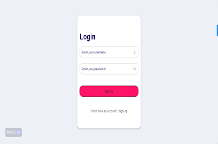
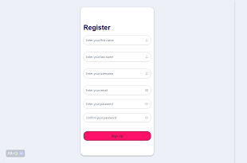
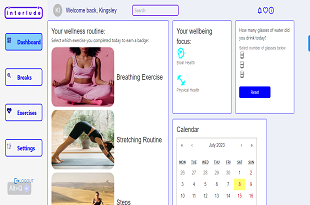
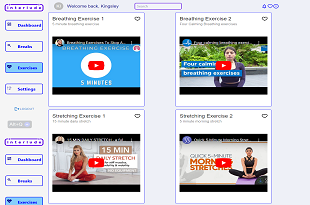
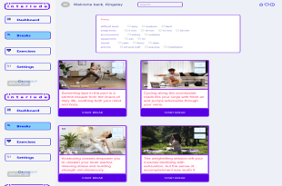
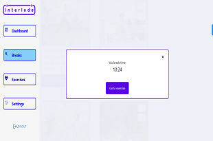
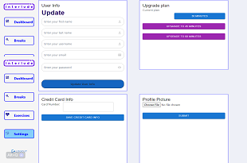

# Work Mental Stress Balance App
This is a Work Mental Stress Balance App which allows Desk-workers to engage in meaningful mental activities during short breaks at work, hence, helping user to manage their mental and physical well-being.
 
- This app is a front-end side of the final capstone project. You can find the back-end app [here](https://github.com/Zaibonisha/interlude-web-app/tree/dev/back-end).
 
Project Screenshots:
<table>
  <tr>
    <td> </td>
    <td></td>
    <td></td>
   </tr> 
   <tr>
      <td></td>
      <td></td>
      <td></td>
  </td>
   <tr>
      <td></td>
  </td>
  </tr>
</table>
 
Project Repo:
[View Here](https://github.com/Zaibonisha/interlude-web-app)
 
# [Live Demo]()
 
# Demo Account
 
# Built with
 - React
 - Redux
 - React Router DOM
 - API
 - Tailwind css
 - Material UI
 
 
## The learning objective of this project are
 
- Create-react-app (frontend app)
- Connect react frontend app to Django backend
- Use API endpoint to post and get data
- Fetch data from the API
 
## Getting Started
 
To get a local copy up and running follow these simple steps.
 
### Prerequisites
 
- [React](https://reactjs.org/tutorial/tutorial.html#prerequisites)
 
### Setup
 
- ```git clone https://github.com/Zaibonisha/interlude-web-app.git``
 
- ```cd front-end```
 
### Set up Backend server running locally
- follow these steps [here](https://github.com/Zaibonisha/interlude-web-app/blob/dev/back-end/README.md)
 
### Running The App Locally
- Run `npm install`

### Set up Backend server running locally
- You need to sign up, then sign in to use the application. Follow these steps [here](https://github.com/Zaibonisha/interlude-web-app/blob/dev/back-end/README.md) to run our Django backend application.
 
# Authors
 
👤 **Kingsley Ibe**
 
- [KingsleyIbe](https://github.com/KingsleyIbe)
- [Twitter](https://twitter.com/ibekingsley2)
- [LinkedIn](https://www.linkedin.com/in/kingsley-ibe/)
 
 
 👤 Emilija Per**
 
- [GitHub]()
- [LinkedIn]()
- [Twitter]()
- [Facebook]()
 
👤 Zaibonisha-Mohamed
 
- [GitHub]()
- [Twitter]()
- [LinkedIn]()

👤 Misgana
 
- [GitHub]()
- [Twitter]()
- [LinkedIn]()

👤 Amin
 
- [GitHub]()
- [Twitter]()
- [LinkedIn]()
 
 
## 🤝 Contributing
 
Contributions, issues, and feature requests are welcome!
 
Feel free to check the [issues page](https://github.com/Zaibonisha/interlude-web-app/issues).
 
## Show your support
 
Give a ⭐️ if you like this project!
 
## Acknowledgments
 
- Hats off to [CodeMonk](https://www.codemonk.ai/) for organizing this awesome Hackathon where this project was submitted. ✨
- And their partnering company [Interlude](https://interlude.digital/) for giving us this opportunity to participate
- The amazing code reviewers for making us improve every day 👍
 
## 📝 License
 
This project is [MIT](./LICENCE) licensed.
* ...
 